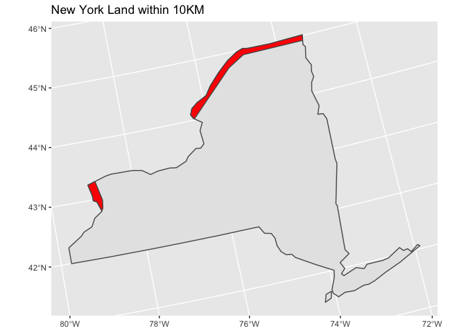

Case_5
================
Suiyuan Wang
10/4/2022

Load packages

## Generate a polygon that includes all land in NY that is within 10km of the Canadian border (not including the great lakes).

Datasets used in this study.

``` r
#load 'world' data from spData package
data(world)
# load 'states' boundaries from spData package
data(us_states)
# plot(world[1])  #plot if desired
# plot(us_states[1]) #plot if desired
```

We used alberts as projection for this project.

``` r
albers="+proj=aea +lat_1=29.5 +lat_2=45.5 +lat_0=37.5 +lon_0=-96 +x_0=0 +y_0=0 +ellps=GRS80 +datum=NAD83 +units=m +no_defs"
```

Transform the projection of world to albers. Then, filter Canada data
from world dataset and set a buffer for Canada polygon. The buffer
distance is 10000m (10KM).

``` r
## world dataset
trans_world <- st_transform(world, albers)
world_Canada <- trans_world %>% filter(name_long=="Canada")
canada_buffer <- st_buffer(world_Canada, dist = 10000)
```

Processing us_states dataset and selecting New York state.

``` r
## us_states object
trans_us <- st_transform(us_states, albers)
us_NY <- trans_us %>% filter(NAME == "New York")
```

Using st_intersection function to get the overlapping area between
Canada and NY. Then, getting the plot for the border area, and using NY
polygon as basemap.

``` r
## creat a 'border' object
border <- st_intersection(canada_buffer, us_NY)
```

    ## Warning: attribute variables are assumed to be spatially constant throughout all
    ## geometries

``` r
ggplot() +
  geom_sf(data = us_NY) +
  geom_sf(data = border, fill = "red") +
  labs(title = "New York Land within 10KM")
```

<!-- -->

``` r
### ggsave("Figure.png")
```

## Calculate it’s area in km^2. How much land will you need to defend from the Canadians?

``` r
area_m <- st_area(border)
set_units(area_m, km^2)
```

    ## 3495.19 [km^2]
