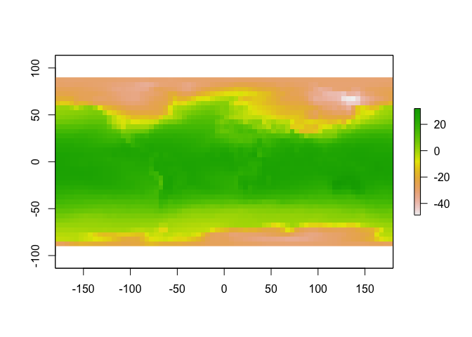
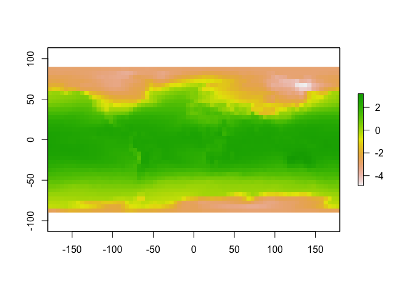
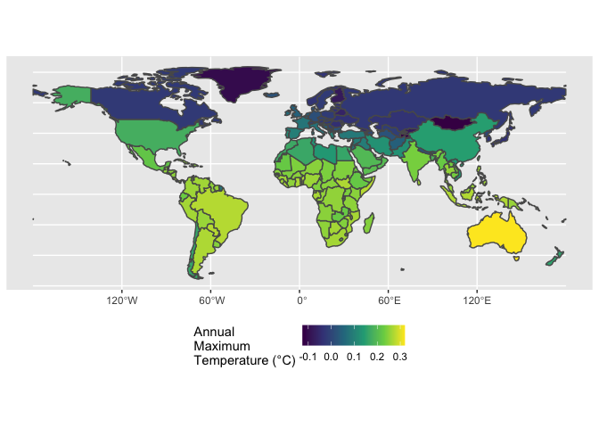

Case_06
================
Suiyuan Wang
10/11/2022

# Find hottest country on each continent

## –Use mean temperature for each country

Load packages

Datasets used in this study. ### Load ‘world’ data from spData package

``` r
data(world)
```

### Get long term mean temperature data from the Climatic Research Unit (CRU).

``` r
library(ncdf4)
download.file("https://crudata.uea.ac.uk/cru/data/temperature/absolute.nc","crudata.nc")
tmean=raster("crudata.nc")
```

##1. Prepare country polygon data (the `world` object). ### 1) Remove
“Antarctica” with `filter()` because WorldClim does not have data there.

``` r
world_remove_Antarctica <- world %>%
  filter(continent != "Antarctica")
```

### 2) Convert the `world` object to `sp` format (the ‘old’ format) because the `raster` package doesn’t accept `sf` objects. you can do this with `as(world,"Spatial")`.

``` r
world_remove_Antarctica_sp <- as(world_remove_Antarctica,"Spatial")
```

## 2. Prepare Climate Data

### 1) Get long term mean temperature data from the Climatic Research Unit (CRU) —`tmean` in above codes.

### 2) Inspect the new tmean object (you can start by just typing it’s name `tmean`, then perhaps making a `plot()`). How many layers does it have? What do these represent? You can read more about the data [here](https://www.worldclim.org/data/worldclim21.html).

``` r
tmean
```

    ## class      : RasterLayer 
    ## band       : 1  (of  12  bands)
    ## dimensions : 36, 72, 2592  (nrow, ncol, ncell)
    ## resolution : 5, 5  (x, y)
    ## extent     : -180, 180, -90, 90  (xmin, xmax, ymin, ymax)
    ## crs        : +proj=longlat +datum=WGS84 +no_defs 
    ## source     : crudata.nc 
    ## names      : CRU_Global_1961.1990_Mean_Monthly_Surface_Temperature_Climatology 
    ## z-value    : 1 
    ## zvar       : tem

``` r
plot(tmean)
```

<!-- -->

### 3) The WorldClim data are stored as hundreths of degrees C. So a real value of 15.5 C would be stored as 155. This saves disk space because they can be stored as `integers` instead of `floating point` numbers. This means each value needs to be multiplied by `0.1` to convert back to degrees C. You can do this with `gain()`.

``` r
gain(tmean) <- gain(tmean)
plot(tmean)
```

<!-- -->

### 4) Create a new object called `tmax_annual` that is the annual maximum temperature in each pixel of the raster stack using `max()`. This will find the maximum temperature in each location across all months.

``` r
tmax_annual <- max(tmean)
```

    ## Warning in max(new("RasterLayer", file = new(".RasterFile", name = "/Users/
    ## suiyuanwang/Documents/GitHub/UB_GEO511_Fall2022/Case_Study/Case 6/crudata.nc", :
    ## Nothing to summarize if you provide a single RasterLayer; see cellStats

``` r
plot(tmax_annual)
```

<!-- -->

``` r
tmax_annual
```

    ## class      : RasterLayer 
    ## band       : 1  (of  12  bands)
    ## dimensions : 36, 72, 2592  (nrow, ncol, ncell)
    ## resolution : 5, 5  (x, y)
    ## extent     : -180, 180, -90, 90  (xmin, xmax, ymin, ymax)
    ## crs        : +proj=longlat +datum=WGS84 +no_defs 
    ## source     : crudata.nc 
    ## names      : CRU_Global_1961.1990_Mean_Monthly_Surface_Temperature_Climatology 
    ## z-value    : 1 
    ## zvar       : tem

### 5) Use `names(tmax_annual) <- "tmax"` to change the name of the layer in the new tmax_annual object to tmax. This makes the later code more intuitive than keeping the default name layer.

``` r
names(tmax_annual) <- "tmax"
```

## 3. Calculate the **maximum mean temperature** observed in each country.

### 1) use `raster::extract()` to identify the maximum temperature observed in each country (`fun=max`). Also set `na.rm=T, small=T, sp=T` to 1) handle missing data along coastlines, 2) account for small countries that may not have a full 0.5 degree pixel in them, and 3) return a spatial polygon object instead of just a vector of values.

``` r
tmax_annual_1 <- raster::extract(x = tmax_annual, y = world_remove_Antarctica_sp, fun = max, na.rm =T, small = T, sp = T)
```

### 2) convert the results of the previous step to sf format with `st_as_sf()`. Now you have an updated polygon object with a new column of maximium temperature. Cool!

### 3) save this spatial feature as `tmax_country`.

``` r
tmax_country <- st_as_sf(tmax_annual_1)
```

## 4. Communicate your results

### 1) use `ggplot()` and `geom_sf()` to plot the maximum temperature in each country polygon (not the original raster layer). To recreate the image below, you will also need `+scale_fill_viridis_c(name="Annual\nMaximum\nTemperature (C)")`. Note the use of `\n` to insert a line break in the text string. You can move the legend around with `+theme(legend.position = 'bottom')`.

``` r
ggplot(tmax_country) + 
  geom_sf(aes(fill = tmax)) +
  coord_sf(label_graticule = "SW", label_axes = "SW") +
  scale_fill_viridis_c(name="Annual\nMaximum\nTemperature (°C)") +
  theme(legend.position = 'bottom')
```

<!-- -->

### 2) use dplyr tools to find the hottest country in each continent. You may need group_by() and top_n. To create a nice looking table, you may also want to use select() to keep only the desired columns, arrange() to sort them, st_set_geometry(NULL) to drop the geometry column (if desired). Save this table as hottest_continents.

``` r
hottest_countries <- tmax_country %>%
  group_by(continent) %>%
  select(name_long, continent, tmax) %>%
  arrange(desc(tmax)) %>%
  st_set_geometry(NULL) %>%
  top_n(1,tmax)

kable(hottest_countries)
```

| name_long                           | continent               | tmax |
|:------------------------------------|:------------------------|-----:|
| Australia                           | Oceania                 | 32.0 |
| Somalia                             | Africa                  | 27.7 |
| Paraguay                            | South America           | 27.7 |
| Timor-Leste                         | Asia                    | 27.6 |
| Costa Rica                          | North America           | 26.1 |
| Albania                             | Europe                  | 12.5 |
| French Southern and Antarctic Lands | Seven seas (open ocean) |  7.1 |
