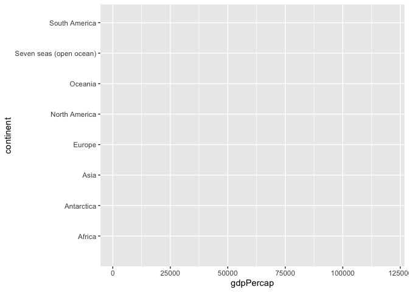

Case_07
================
Suiyuan Wang
10/18/2022

Example codes.

``` r
library(tidyverse)
```

    ## ── Attaching packages ─────────────────────────────────────── tidyverse 1.3.2 ──
    ## ✔ ggplot2 3.3.6     ✔ purrr   0.3.4
    ## ✔ tibble  3.1.6     ✔ dplyr   1.0.9
    ## ✔ tidyr   1.1.4     ✔ stringr 1.4.0
    ## ✔ readr   2.1.2     ✔ forcats 0.5.2
    ## ── Conflicts ────────────────────────────────────────── tidyverse_conflicts() ──
    ## ✖ dplyr::filter() masks stats::filter()
    ## ✖ dplyr::lag()    masks stats::lag()

``` r
library(reprex)
library(sf)
```

    ## Linking to GEOS 3.10.2, GDAL 3.4.2, PROJ 8.2.1; sf_use_s2() is TRUE

``` r
library(spData)
data(world)
ggplot(world,aes(x=gdpPercap, y=continent, color=continent))+
   geom_density(alpha=0.5,color=F)
```

    ## Warning: Removed 17 rows containing non-finite values (stat_density).

<!-- --> Copy
the codes before, and run the following codes.

``` r
#reprex(venue="gh")
```

Go to GitHub and report a new issue, paste the Reprex output and Submit
it.
