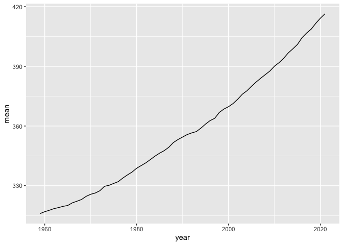

Case 8
================
Suiyuan Wang
10/25/2022


### Read the “Mauna Loa CO2 annual mean data” from this [website](https://gml.noaa.gov/ccgg/trends/data.html).

``` r
CO2_mean = read_table('ftp://aftp.cmdl.noaa.gov/products/trends/co2/co2_annmean_mlo.txt',col_names = c('year', 'mean', 'unc'), skip = 57)
```

    ## 
    ## ── Column specification ────────────────────────────────────────────────────────
    ## cols(
    ##   year = col_double(),
    ##   mean = col_double(),
    ##   unc = col_double()
    ## )

``` r
CO2_mean
```

    ## # A tibble: 63 × 3
    ##     year  mean   unc
    ##    <dbl> <dbl> <dbl>
    ##  1  1959  316.  0.12
    ##  2  1960  317.  0.12
    ##  3  1961  318.  0.12
    ##  4  1962  318.  0.12
    ##  5  1963  319.  0.12
    ##  6  1964  320.  0.12
    ##  7  1965  320.  0.12
    ##  8  1966  321.  0.12
    ##  9  1967  322.  0.12
    ## 10  1968  323.  0.12
    ## # … with 53 more rows

### Make one timeseries plot (ggplot of CO2\~time)

``` r
ggplot(data = CO2_mean, mapping = aes(x = year, y = mean)) + geom_line()
```

<!-- -->

### Make one table. This table can summarize anything you want (top 5 years?)

``` r
top_years <- CO2_mean %>% arrange(desc(mean))
knitr::kable(top_years[1:5,1:3], col.names = c('year', 'mean', 'unc'), caption = "Mauna Loa Top 5 years CO2 annual mean data.", "simple")
```

| year |   mean |  unc |
|-----:|-------:|-----:|
| 2021 | 416.45 | 0.12 |
| 2020 | 414.24 | 0.12 |
| 2019 | 411.66 | 0.12 |
| 2018 | 408.72 | 0.12 |
| 2017 | 406.76 | 0.12 |

Mauna Loa Top 5 years CO2 annual mean data.
