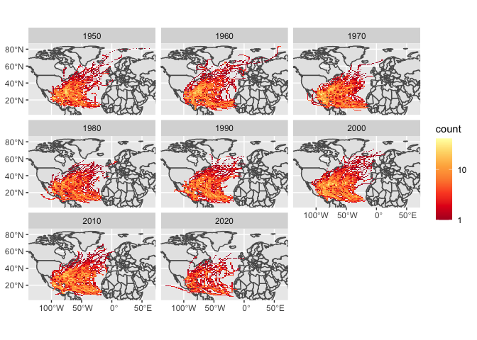

Case 9
================
Suiyuan Wang
11/01/2022


## Objective

In this case study you will download storm track data from NOAA, make a
summary plot, and quantify how many storms have hit each of the United
States. This will require you to use a spatial join (st_join).

### 1. Download zipped data from noaa with storm track information

``` r
dataurl="https://www.ncei.noaa.gov/data/international-best-track-archive-for-climate-stewardship-ibtracs/v04r00/access/shapefile/IBTrACS.NA.list.v04r00.points.zip"

tdir=tempdir()
download.file(dataurl,destfile=file.path(tdir,"temp.zip"))
unzip(file.path(tdir,"temp.zip"),exdir = tdir) #unzip the compressed folder
storm_data <- read_sf(list.files(tdir,pattern=".shp",full.names = T))
```

### 2. Wrangle the data

Filter to storms 1950-present with filter()

``` r
storm_1950_present <- filter(storm_data, year > 1949)
```

Use `mutate_if()` to convert `-999.0` to `NA` in all numeric columns
with the following command from the `dplyr` package:
`mutate_if(is.numeric, function(x) ifelse(x==-999.0,NA,x))`

``` r
storm_1950_mutate <- storm_1950_present %>% mutate_if(is.numeric, function(x) ifelse(x==-999.0,NA,x))
```

Use the following command to add a column for decade:
`mutate(decade=(floor(year/10)*10))`

``` r
storms <- storm_1950_mutate %>%
  mutate(decade=(floor(year/10)*10))
```

Use `st_bbox()` to identify the bounding box of the storm data and save
this as an object called `region`.

``` r
region <- storms %>%
  st_bbox(c(xmin= -128.5, ymin= 6.2, xmax= 63, ymax= 83.01))
```

### 3. Make the first plot

``` r
plot <- ggplot(world) +
  facet_wrap(~decade) +
  geom_sf() +
  stat_bin2d(data=storms,aes(y=st_coordinates(storms)[,2],x=st_coordinates(storms)[,1]),bins=100) +
  scale_fill_distiller(palette="YlOrRd", trans="log", direction=-1, breaks = c(1,10,100,1000)) +
  coord_sf(ylim=region[c(2,4)], xlim=region[c(1,3)]) +
  theme(axis.title = element_blank())

plot
```

<!-- -->

### 4. Calculate table of the five states with most storms.

use `st_transform` to reproject `us_states` to the reference system of
the `storms` object (you can extract a CRS from a sf object with
`st_crs(storms)`

``` r
crs <- st_crs(storms)
states <- st_transform(us_states, crs)
```

Rename the `NAME` column in the `state` data to `state` avoid confusion
with storm name using `select(state=NAME)`

``` r
states <- states %>% select(state=NAME)
```

Perform a spatial join between the storm database and the states object
with:
`storm_states <- st_join(storms, states, join = st_intersects,left = F)`.
This will ’add\` the state to any storm that was recorded within that
state.

``` r
storm_states <- st_join(storms, states, join = st_intersects,left = F)
```

Use `group_by(state)` to group the next step by US state

``` r
group_state <- group_by(storm_states, state)
```

use `summarize(storms=length(unique(NAME)))` to count how many unique
storms occurred in each state.

``` r
sum_state <- group_state %>%  summarize(storms=length(unique(NAME)))
```

use `arrange(desc(storms))` to sort by the number of storms in each
state

``` r
arrange_sum <- sum_state %>%  arrange(desc(storms))
```

use `slice(1:5)` to keep only the top 5 states

``` r
top_years <- arrange_sum  %>%  slice(1:5)
table <- top_years %>% st_drop_geometry()
knitr::kable(table, "simple")
```

| state          | storms |
|:---------------|-------:|
| Florida        |     86 |
| North Carolina |     66 |
| Georgia        |     58 |
| Texas          |     54 |
| Louisiana      |     52 |
